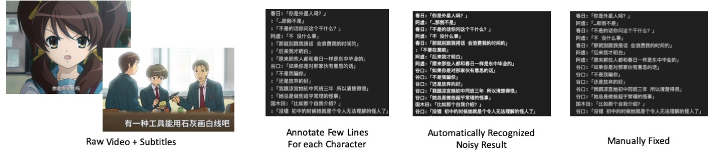
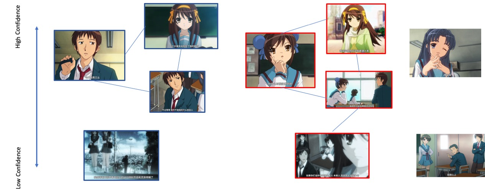
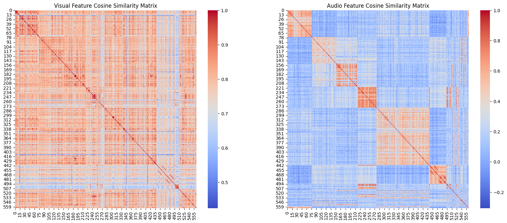
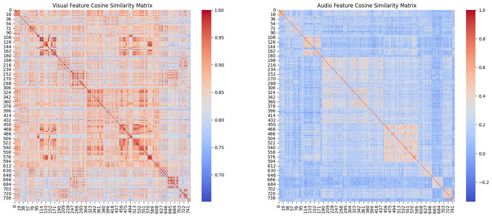
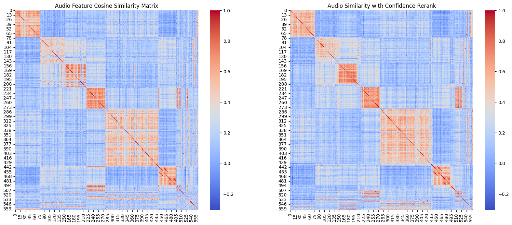
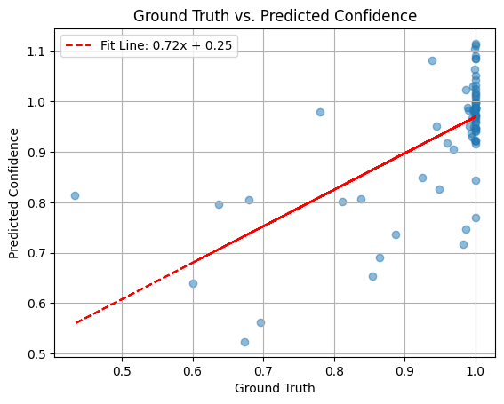

# Scalable Video Speaker Grouping using Speech and Image feature 

本项目是 [Chat凉宫春日](https://github.com/LC1332/Chat-Haruhi-Suzumiya) 社区的一个子项目，意在建立一个更好的pipeline，能够批量地分离视频的数据，为视频中的每一句话标记上对应的角色，便于给其他的AI模型提供多模态的训练数据。

【配图】

本项目是一个在建的项目，并且我们也在招募新的开发者加入，如果你对这个项目感兴趣，欢迎到我的[知乎主页](https://www.zhihu.com/people/cheng-li-47)或者发送你的微信号到 chengli.thu@gmail.com 联系我。

---

- [引言](#引言)
- [检测指标](#检测指标)
- [TODO和成员招募](#TODO和成员招募)
- [中间结果记录](#中间结果记录)

---

# 引言

随着语言模型和Stable Diffusion等很多新的AI模型的出现，我们逐渐意识到文本数据，以及文本和其他模态结合的数据是很重要的。并且在[Chat凉宫春日](https://github.com/LC1332/Chat-Haruhi-Suzumiya)中，我们验证了使用现有ip的数据，可以构造一个更生动的角色扮演。现在模型训练时使用的文本数据或者图文数据往往都是从互联网或者书本中抓取的。视频数据提供了更丰富的文本和其他模态结合的数据，却因为较少标注而较难理解。

在这个前提下，我们希望能够对视频数据进行更好的标注。事实上字幕数据已经能够提供足够的文本信息。然而，对于过往的影视作品，有一个很大的问题是字幕的数据并没有进行说话人的标注，这使得语言模型在理解字幕数据的时候会遇到很大的困难。因此，本项目希望在给定视频，以及可选的字幕数据的情况下，能够自动地对视频进行分割，并且标注上说话人的信息。这些数据在之后可以被进一步应用于声纹识别，声音合成，动漫角色识别，跨模态的语言模型训练，跨模态的角色扮演等模型的训练。

<p align="center">
    
</p>

【配图:过往的工作流，原始CSV->部分标注->KNN->自动标注->人工整理】
【配图:过往的工作流，whisper识别->原始CSV->部分标注->KNN->自动标注->人工整理】

在Chat凉宫春日中，我们已经尝试了一个简单的方法，先对部分字幕的句子进行人工的角色标注，然后利用K近邻算法对剩余的句子进行自动标注。这个方法在一定程度上提高了标注的效率。但是在实践中，这个方法有很大的人工成本，在后续的人工整理中，标注者需要播放整个视频，对标注结果进行修正和分析。这个过程是非常耗时的。因此，我们希望能够通过更好的算法，减少人工标注的工作量。

我们注意到使用之前的工作流有一些问题: 1. 声纹识别的特征的准确率有限。这是由于目前并没有超大量的公开数据对声纹识别进行训练。 2. 有一些字幕对应的句子并不适合抽取声纹特征，如较短的句子，叠加了复杂背景噪声的句子。 3. 在之前的工作流中，并没有利用到视频的信息。对于较为简单的动画来说，一些句子对应的画面中往往只有一个角色。这个信息可以帮助我们更好地进行说话人的识别。

由此，我们提出了一套新的方法来进行说话人的识别与聚类。1. 我们的方法将同时利用声音和图像的特征进行聚类。 2. 我们的方法是基于学习的，整个方法会在一定数量的视频数据上进行训练，并确定声音和图像的一个置信度模型，对于置信度较高的句子，先行进行聚类。置信度较低的句子后聚类，并且不会因为一些质量较差的句子，把多个类错误地聚合在一起。 3. 标注者只要对聚类后的结果进行较少的人工整理，并且不需要观看整个视频，就可以得到完整的说话人标注，这使得我们规模化地标注视频的说话人数据成为可能。

【如果这个做完之后，其实 还可以根据字幕结合llm自动去诊断说话人，当然这个就属于拓展了】

# 方法

我们的方法基于一个很简单的直觉，视频中有些句子是容易分离出来的，比如当画面只有单一角色，对应的这一句台词清晰且长度足够的时候，声纹特征往往会给出正确的判断。另一方面，如果声音出现较多的噪音，甚至噪音过多使得其偏离声纹模型训练集的分布，那么这样的句子是"危险"的，因为过往的聚类算法很有可能把多个不同类别，但是都是out of distribution的特征认为是相近的，最后出现把多个标签不同的人物聚合在一起的情况。

<p align="center">
    
</p>

因此，我们使用一个简单的置信度分离的策略，即我们去估计每一个句子的置信度 $c$ ，对于高于特定阈值的句子先进行聚类。对于低于特定阈值的句子，只能加入已有的类别，而不能使得两个已经建立的类别合并。这样的策略可以保证我们的聚类结果是稳定的，即使有一些质量较差的句子，也不会对聚类结果产生太大的影响。

## 特征的置信度学习

这里我们假设已经获取到每个样本 $i$ 的特征 $x_i$ 和标签 $y_i$ ，我们希望去估计样本的置信度 $c_i$ 。这是一个经典的机器学习问题，我们可以使用一个简单的N-fold检验，并查看样本 $i$ 在其他的N-1个fold上的预测结果是否和真实标签一致。以一致的概率作为置信度。 特别地，当N-fold检验时使用的分类器为一个 3-NN 分类器时，我们可以较快的估计准确率的结果，即查看距离 $x_i$ 最近的 $M N$ 个样本，从这些样本中随机抽取M个样本时，前3个样本是 $y_i$ 的概率，这个概率可以用一个简单的线性动态规划算法来计算。这个动态规划算法我们会在附录中进行介绍。

在获取到样本的真实置信度之后，我们有两种方法去学习样本的估计置信度 $c(x)$ ， 一种是直接使用特征对置信度进行回归。另一张方法，考虑到对比不同大小的类别时，置信度的排序是可靠的，而绝对值是没有那么有效的。所以我们可以建立一套learning to rank的架构，来估计置信度。

## Learning Based的聚类算法

在层次聚类的算法中，算法会不断合并两个相近的类别来进行聚类。在He的工作中，引入了一个决策器来决定每一次类别是否被真的合并。我们也使用类似的架构，但是使用一个更为简化的版本。我们每次考虑样本 $i$ , $j$ 以及其所在的类别是否要被合并， 这个时候我们会引入6个特征， $i$ 和 $j$ 句子的声纹相似度，图片的相似度，以及 $i$ 和 $j$ 各自声纹和图片特征计算得到的置信度。我们使用一个简单的神经网络 $m$ 来进行二分类的估计，确定是否要合并这两个类别。

在He的工作中，需要额外考虑 $i$ 和 $j$ 类别中其他样本的综合影响，以及其他样本和 $i$, $j$ 样本的相似度。在初步的实验中我们先忽略这些的影响。

**合并网络训练样本的抽取** 在一个模拟的有标签视频 $(X,Y)$ 中，我们直接运行一个层次聚类，每次合并最短的边。如果一条待合并的边的标签是一致的，我们就合并并且计算为正样本，否则则不合并，被计为负样本。这样可以尽可能抽取较为接近真实分布的负样本。当然这样也等价于只抽取实际合并时的正样本以及最接近的 $N$ 个负样本， $N$ 为类别的个数。所以我们也可以直接抽取最接近的 $MN$ 个负样本，以及一些随机的正样本来作为训练样本。

## 低置信度的排除

为了尽可能简化我们的框架，使得整个工作流可以在更多视频上运行，我们去掉了He工作中强化学习以及多次合并的部分，并引入一条规则，对于声纹置信度 $c(x_i)$ 和 $c(x_j)$ 都低于一个特定阈值的边，我们直接不合并。这样可以尽可能保证我们的结果不受到噪音的影响。

# 检测指标

由于在聚类算法运行的时候，我们并不知道Speaker的名单，所以并不能像分类任务一样对聚类的结果进行评价。这里我们主要使用pairwise边的准确率，召回率和对应的F_1进行评价。同时，因为本项目的最终目标是获得“易于进行spearker标注”的工作流，我们还额外引入一个“操作量”的概念进行评价，操作量与一个annotator在自动聚类后实际完成一个视频标注所需要的额外工作量正相关。

## Edge-precision, recall, F_1

对于任意样本 $i$ 和 $j$ ， 如果他们属于同一个Speaker，则我们认为边 $(i,j)$ 是一个正样本，否则，认为边是一个负样本。在这种情况下，我们可以去计算边级别的precision和recall。这里我们记聚类算法输出的类别名为G，ground truth的类别名为Y，那么Edge-Precision的定义为

$ Pr( Y(i)==Y(j) | G(i) == G(j) )$

Edge-Recall的定义为

$ Pr( G(i)==G(j) | Y(i) == Y(j) )$

而Edge-F_1为两者的调和平均数。注意到这是一个相对严苛的评价指标。

## 操作次数

在使用操作次数进行评价时，我们假设用户可以进行三个操作 1.把一个单独的样本加入到某个类别中 2.从一个类别中删除一个某个样本 3.将一个类别合并到另一个类别中。显然，任何一个聚类的结果总是可以通过有限次的操作被最终修正成ground truth。那么，我们可以使用三个操作的次数的加权，来衡量一个annotator需要额外投入的标注工作量。


# 引用

这个方法参考和简化了我们之前的工作

```bibtex
@inproceedings{he2018merge,
  title={Merge or not? learning to group faces via imitation learning},
  author={He, Yue and Cao, Kaidi and Li, Cheng and Loy, Chen},
  booktitle={Proceedings of the AAAI Conference on Artificial Intelligence},
  volume={32},
  number={1},
  year={2018}
}
```


# TODO和成员招募


## 待聚类的输入数据格式确定
这个和scixing讨论下？
- 这里要确定最终进入聚类前的数据格式（模型无关）
  - 每一条数据应该包括  标签、一张图、音频
  - 最好是接近密集存储的，实在不行也可以打成zip
- 确定从什么样的数据可以切分到这样的数据
  - 现在想一想输入至少要 原始视频、字幕文件、标注后的csv文件
- 确定标注数据的格式
  - 感觉是csv比较合适
- 从之前的代码中整理出可以运行的部分
  - 确定好之后，把之前的《凉宫春日》和《亮剑》整理成对应的格式
  - 应该加起来有7个左右标注后的视频
- 先打包成最终聚类前的数据格式

## 预标注工具的确认
寻找两个待标注的视频，确认字幕和视频是同步的
- 设想流程还是 srt2csv先，
- 然后进行简单的人物标注后 csv
- 根据部分标注的csv，KNN出基础的结果，出新的csv
- 人工进行进一步标注
- 返回前面那个工具进行最终切分

我们假设这个任务是在整套高级的聚类算法形成之前做的研究性标注
当然如果接口预留得好，也可以最终接入最终的算法

这个任务 鲁叔和scixing进行 初步的代码整理，之后交给肖君枫以及其他数据集负责同学进行测试
可以有同学接受这个部分写得更强一些

## 声纹特征的抽取
待报名
- 跑通之前项目的声纹提取
- 扩展声纹提取到batch抽取
- 确定声纹提取的接口比如features =  extract_feature( file_names)
- 调研中、英、日是否有特别的声纹识别模型
- 在已经标注的数据上，测试各个模型的交叉验证准确率
这个如果没人就先沿用之前的特征

## 图片特征的抽取
待报名
- 跑通CLIP里面的ViTs抽取
- 扩展到batch抽取（其实我们之前留了代码）
- 确定接口 比如 features = extract_features( file_names )
- 在已经标注的数据上，测试各个模型的交叉验证准确率

这个如果没人就沿用之前的vits或者看之前参考项目


# 中间结果记录

## 视觉特征和声纹特征的相似度矩阵

凉宫春日-03

<p align="center">
    
</p>

亮剑-10

<p align="center">
    
</p>

## 置信度重排序

计算置信度之后对声纹的相似度矩阵重新排序

<p align="center">
    
</p>

## 聚类的baseline

凉宫春日-03

'precision': 0.9858982843761136, 'recall': 0.8511405089438755

亮剑-10

'precision': 0.9627016885553471, 'recall': 0.4727212426068211

比我预期要高

确认了scixing在代码中用的模型是

## 特征到置信度回归

声纹到置信度还是可以回归的，视觉到置信度回归看起来比较惨烈

<p align="center">
    
</p>